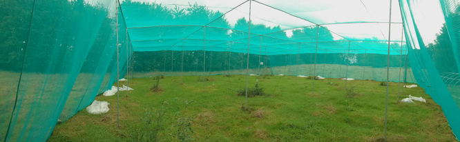

# ButterflyBehave
Butterfly behavioural and plant abundance data analysis.

## Aim
This repository aims to containing all scripts for any data analysis performed with behavioural and plant data from Prof. Nieberding's lab.

  

